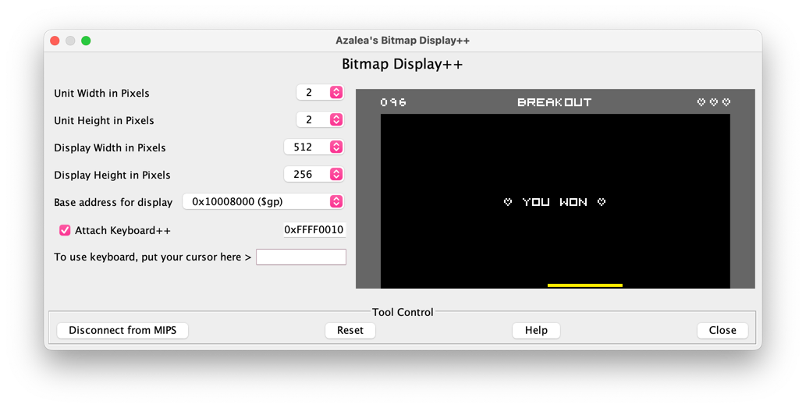
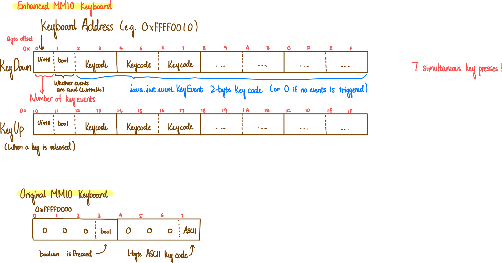

## E-MARS: Enhanced MARS Assembler

[MARS][1] is a lightweight interactive development environment (IDE) for programming in MIPS assembly language, developed by [Pete Sanderson][4] (programming) and [Ken Vollmar][5], intended for educational-level use with Patterson and Hennessy's Computer Organization and Design.

**EMARS** (this repo) is Azalea's enhanced version of MARS.

## Changes from Mars 4.5:

### EMARS 4.7

* Switched to Gradle build system with Kotlin support
* Added `--open` command-line option to open a file on start
* Added **Keyboard++**: Enhanced keyboard events
* Refactored many classes in Kotlin
* A LOT of [optimizations](https://github.com/hykilpikonna/EMARS#optimizations)

## FAQ

**How to run:** Install Java JDK >11 and double-click on the jar.  
**How to compile:** `gradle shadowJar`

## Modifications needed

1. To use **Bitmap Display++**, please add the following code at the end of each render loop:

```asm
# Tell the display to update
lw   $t8, ADDR_DISPLAY
li   $t9, 1
sw   $t9, 0($t8)
```

## Keyboard++



Mars' MMIO Keyboard can only send one key event at any given time, and key repeats are handled by the operating system running Java, which is very bad for controlling a game because of the delay and inconsistency introduced.

So I developed the enhanced **Keyboard++** with additional features:

* **14 simultaneous key events!**  
(MARS 4.5 can read only 1 key at a time)
* **Fine control of separate key-down and key-up events**  
(MARS 4.5 can only read keys typed)
* **Use 2-byte key code** instead of 1-byte ASCII char  
(Non-character keys like arrows & F1-F12 can now be read)
* **Filter out system key repeats**  
(Pressing a key for longer will not repeat any event)
* **Use "clear byte"** to indicate if the events should be cleared  
(MARS 4.5 clears the key byte whenever it is read)

### Specification



From the initial address, the first 4 words (16 bytes) represents key-down events (when a key is first pressed). The next 4 words (16 bytes) represent key-up events.

For each event type, the 0x0 byte stores an unsigned integer `n`, ranging from `0` to `7`, representing how many key events are pooled. 

The 0x1 byte tells the keyboard handler whether the events are read by your MIPS program and should be reset. If 1 is written to the 1st byte, then all keys in the current event cycle will be cleared to 0.

From the 0x2 byte to the 0xF byte stores `n` unsigned 2-byte key codes received, in chronological order. (e.g. the 0x2 half-word stores the first key that's pressed after the last reset). The keycodes are the same with the keycodes used in Java's KeyEvent class. I've attached a list of keycodes extracted from the class below.

### Sample

Here's a sample MIPS code that reads events from Keyboard++:

<details>
  <summary>Example MIPS Program using Keyboard++</summary>

```asm
.data

# The addresses of Keyboard++
ADDR_KEY_DOWN: .word 0xffff0010
ADDR_KEY_UP: .word 0xffff0020

# Example variables
PAUSED: .word 1
KEY_MOVE_DIRECTION: .byte 0

.text

# """
# read_keyboard()
# 
# Listen to keyboard events
# """
read_keyboard:
    
    # Save items onto the stack: ra, s0, s1
    sw   $ra, -4($sp)
    sw   $s0, -8($sp)
    sw   $s1, -12($sp)
    addi $sp, $sp, -12

    # 1. Check for key down event
    lw   $s0, ADDR_KEY_DOWN
    lbu  $s1, 0($s0)
    beq  $s1, 0, key_down_none

    # In a loop, read the keys that are down (pressed)
    # while (s1 > 0)
    while_1_0:
    sub  $t9, $s1, $zero
    blez $t9, while_done_1_0
    # {
        # Move offset to the next half-word
        addiu $s0, $s0, 2

        # Read half-word keycode
        lhu   $t2, 0($s0)

        # if (t2 == 0x51): Q, quit
        bne  $t2, 0x51, else_2_0
            li   $v0, 10
            syscall
        else_2_0:

        # if (t2 == 0x20): Space, lauch ball
        bne  $t2, 0x20, else_2_2
        # if (PAUSED == 1)
        lw   $t9, PAUSED
        bne  $t9, 1, else_2_2
            jal  launch
        else_2_2:

        # if (t2 == 0x25): Left arrow, set flag that we're moving left
        bne  $t2, 0x25, else_2_3
            li   $t9, -1
            sw   $t9, KEY_MOVE_DIRECTION
        else_2_3:

        # if (t2 == 0x27): Right arrow, set flag that we're moving right
        bne  $t2, 0x27, else_2_4
            li   $t9, 1
            sw   $t9, KEY_MOVE_DIRECTION
        else_2_4:
        
        # Next iteration
        addi $s1, $s1, -1
    # }
    j    while_1_0
    while_done_1_0:

    # When we're done, write 1 to offset 1 to clear events
    lw   $s0, ADDR_KEY_DOWN
    li   $s1, 1
    sb   $s1, 1($s0)

    key_down_none:

    # 2. Check for key up event
    lw   $s0, ADDR_KEY_UP
    lbu  $s1, 0($s0)
    beq  $s1, 0, key_up_none

    # In a loop, read the keys that are up (released)
    # while (s1 > 0)
    while_1_1:
    sub  $t9, $s1, $zero
    blez $t9, while_done_1_1
    # {
        addiu $s0, $s0, 2
        lhu  $t2, 0($s0)
        
        # Left arrow released, unset flag
        # if (t2 == 0x25 && KEY_MOVE_DIRECTION == -1)
        bne  $t2, 0x25, else_2_5
        lw   $t9, KEY_MOVE_DIRECTION
        bne  $t9, -1, else_2_5
            li   $t9, 0
            sw   $t9, KEY_MOVE_DIRECTION
        else_2_5:

        # Right arrow released, unset flag
        # if (t2 == 0x27 && KEY_MOVE_DIRECTION == 1)
        bne  $t2, 0x27, else_2_6
        lw   $t9, KEY_MOVE_DIRECTION
        bne  $t9, 1, else_2_6
            li   $t9, 0
            sw   $t9, KEY_MOVE_DIRECTION
        else_2_6:
        
        addi $s1, $s1, -1
    # }
    j    while_1_1
    while_done_1_1:

    # When we're done, write 1 to offset 1 to clear events
    lw   $s0, ADDR_KEY_UP
    li   $s1, 1
    sb   $s1, 1($s0)

    key_up_none:

    # Retrieve items from the stack: ra, s0, s1
    lw   $s1, 0($sp)
    lw   $s0, 4($sp)
    lw   $ra, 8($sp)
    addi $sp, $sp, 12
    jr   $ra
```

</details>

### List of Keycodes

<details>
  <summary>List of all key codes</summary>

```python
ENTER          = 0xA
BACK_SPACE     = 0x8
VK_TAB         = 0x9

# Regex used to extract keys: (?<=VK_)([A-Z0-9_]+) += +?([0-9A-Fa-fx]+)(?=;)
CANCEL         = 0x03
CLEAR          = 0x0C
SHIFT          = 0x10
CONTROL        = 0x11
ALT            = 0x12
PAUSE          = 0x13
CAPS_LOCK      = 0x14
ESCAPE         = 0x1B
SPACE          = 0x20
PAGE_UP        = 0x21
PAGE_DOWN      = 0x22
END            = 0x23
HOME           = 0x24
LEFT           = 0x25
UP             = 0x26
RIGHT          = 0x27
DOWN           = 0x28
COMMA          = 0x2C
MINUS          = 0x2D
PERIOD         = 0x2E
SLASH          = 0x2F
0              = 0x30
1              = 0x31
2              = 0x32
3              = 0x33
4              = 0x34
5              = 0x35
6              = 0x36
7              = 0x37
8              = 0x38
9              = 0x39
SEMICOLON      = 0x3B
EQUALS         = 0x3D
A              = 0x41
B              = 0x42
C              = 0x43
D              = 0x44
E              = 0x45
F              = 0x46
G              = 0x47
H              = 0x48
I              = 0x49
J              = 0x4A
K              = 0x4B
L              = 0x4C
M              = 0x4D
N              = 0x4E
O              = 0x4F
P              = 0x50
Q              = 0x51
R              = 0x52
S              = 0x53
T              = 0x54
U              = 0x55
V              = 0x56
W              = 0x57
X              = 0x58
Y              = 0x59
Z              = 0x5A
OPEN_BRACKET   = 0x5B
BACK_SLASH     = 0x5C
CLOSE_BRACKET  = 0x5D
NUMPAD0        = 0x60
NUMPAD1        = 0x61
NUMPAD2        = 0x62
NUMPAD3        = 0x63
NUMPAD4        = 0x64
NUMPAD5        = 0x65
NUMPAD6        = 0x66
NUMPAD7        = 0x67
NUMPAD8        = 0x68
NUMPAD9        = 0x69
MULTIPLY       = 0x6A
ADD            = 0x6B
SEPARATER      = 0x6C
SUBTRACT       = 0x6D
DECIMAL        = 0x6E
DIVIDE         = 0x6F
DELETE         = 0x7F
NUM_LOCK       = 0x90
SCROLL_LOCK    = 0x91
F1             = 0x70
F2             = 0x71
F3             = 0x72
F4             = 0x73
F5             = 0x74
F6             = 0x75
F7             = 0x76
F8             = 0x77
F9             = 0x78
F10            = 0x79
F11            = 0x7A
F12            = 0x7B
F13            = 0xF000
F14            = 0xF001
F15            = 0xF002
F16            = 0xF003
F17            = 0xF004
F18            = 0xF005
F19            = 0xF006
F20            = 0xF007
F21            = 0xF008
F22            = 0xF009
F23            = 0xF00A
F24            = 0xF00B
PRINTSCREEN    = 0x9A
INSERT         = 0x9B
HELP           = 0x9C
META           = 0x9D
BACK_QUOTE     = 0xC0
QUOTE          = 0xDE
KP_UP          = 0xE0
KP_DOWN        = 0xE1
KP_LEFT        = 0xE2
KP_RIGHT       = 0xE3
DEAD_GRAVE               = 0x80
DEAD_ACUTE               = 0x81
DEAD_CIRCUMFLEX          = 0x82
DEAD_TILDE               = 0x83
DEAD_MACRON              = 0x84
DEAD_BREVE               = 0x85
DEAD_ABOVEDOT            = 0x86
DEAD_DIAERESIS           = 0x87
DEAD_ABOVERING           = 0x88
DEAD_DOUBLEACUTE         = 0x89
DEAD_CARON               = 0x8a
DEAD_CEDILLA             = 0x8b
DEAD_OGONEK              = 0x8c
DEAD_IOTA                = 0x8d
DEAD_VOICED_SOUND        = 0x8e
DEAD_SEMIVOICED_SOUND    = 0x8f
AMPERSAND                = 0x96
ASTERISK                 = 0x97
QUOTEDBL                 = 0x98
LESS                     = 0x99
GREATER                  = 0xa0
BRACELEFT                = 0xa1
BRACERIGHT               = 0xa2
AT                       = 0x0200
COLON                    = 0x0201
CIRCUMFLEX               = 0x0202
DOLLAR                   = 0x0203
EURO_SIGN                = 0x0204
EXCLAMATION_MARK         = 0x0205
INVERTED_EXCLAMATION_MARK = 0x0206
LEFT_PARENTHESIS         = 0x0207
NUMBER_SIGN              = 0x0208
PLUS                     = 0x0209
RIGHT_PARENTHESIS        = 0x020A
UNDERSCORE               = 0x020B
WINDOWS                  = 0x020C
CONTEXT_MENU             = 0x020D
FINAL                    = 0x0018
CONVERT                  = 0x001C
NONCONVERT               = 0x001D
ACCEPT                   = 0x001E
MODECHANGE               = 0x001F
KANA                     = 0x0015
KANJI                    = 0x0019
ALPHANUMERIC             = 0x00F0
KATAKANA                 = 0x00F1
HIRAGANA                 = 0x00F2
FULL_WIDTH               = 0x00F3
HALF_WIDTH               = 0x00F4
ROMAN_CHARACTERS         = 0x00F5
ALL_CANDIDATES           = 0x0100
PREVIOUS_CANDIDATE       = 0x0101
CODE_INPUT               = 0x0102
JAPANESE_KATAKANA        = 0x0103
JAPANESE_HIRAGANA        = 0x0104
JAPANESE_ROMAN           = 0x0105
KANA_LOCK                = 0x0106
INPUT_METHOD_ON_OFF      = 0x0107
CUT                      = 0xFFD1
COPY                     = 0xFFCD
PASTE                    = 0xFFCF
UNDO                     = 0xFFCB
AGAIN                    = 0xFFC9
FIND                     = 0xFFD0
PROPS                    = 0xFFCA
STOP                     = 0xFFC8
COMPOSE                  = 0xFF20
ALT_GRAPH                = 0xFF7E
BEGIN                    = 0xFF58
UNDEFINED      = 0x0
```

</details>


## Optimizations

In MARS, the BitmapDisplay [re-draws the entire canvas](https://github.com/thomasrussellmurphy/MARS_Assembler/blob/c21dd72e8d2e4a51eb24e276c3f39ef1789148f2/mars/tools/BitmapDisplay.java#L496) instead of only the updated pixels whenever any memory address is updated. This makes updating the display very very very slow, taking 12% of all run time.


For example, if I loop through the display and change every pixel in my assembly code, the original running time of h∗w will now take h2∗w2, making it take around one second for each update.

Since I can’t easily draw one pixel on update without manual manipulation of AWT Graphics, I changed it so that it treats bit 0 of the memory display as an “update bit,” and only re-draw the screen when the MIPS program sets bit 0 to 1.

After optimizing for this, it runs faster but still not enough for the animation to be smooth. Then, I discovered that most of the running time is used by the backstepper and notifying observers for changes in registers and memory:


By default, MARS will store backstep register file copies each time a register is updated, which takes a lot of time since registers are updated very frequently. So I removed backstepping when the execution speed limit is not set. MARS also notifies all memory observers when a program statement instruction is read from memory, which I also removed because nothing uses the notification from reading program statements.


## License
[MIT][2]. Chech the [LICENSE][3] file. All the credits go to the original developers.

  [1]: http://courses.missouristate.edu/KenVollmar/MARS/index.htm
  [2]: http://www.opensource.org/licenses/mit-license.html
  [3]: https://github.com/adolphenom/MARS_Assembler/blob/master/LICENSE
  [4]: http://faculty.otterbein.edu/PSanderson/
  [5]: http://courses.missouristate.edu/KenVollmar/
  [6]: http://courses.missouristate.edu/KenVollmar/MARS/download.htm
  [7]: http://courses.missouristate.edu/KenVollmar/MARS/Help/MarsHelpIntro.html
  [8]: http://twitter.com/aesptux
